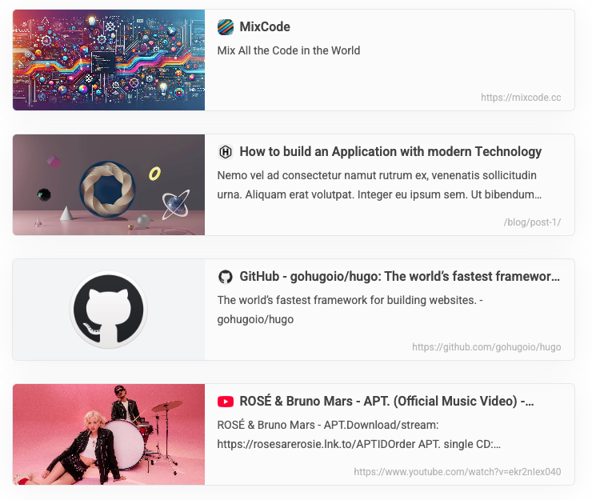

# Hugo Modules

Hugo Modules is a personal project I've developed. Feel free to contribute if you have suggestions or want to improve it!

## Pretty Link ✨

**Screenshots**

**Live Demo**: https://hugoplate-pretty-link.pages.dev/blog/introduce-pretty-link/

**How to use**: [README.md](shortcodes/pretty-link/README.md)
